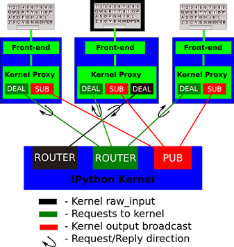

# ICSharpCore
The Jupyter team maintains the [IPython kernel](https://github.com/ipython/ipython) since the Jupyter notebook server depends on the IPython [kernel](https://jupyter.readthedocs.io/en/latest/glossary.html#term-kernel) functionality. Many other languages, in addition to Python, may be used in the notebook. **ICSharpCore** is one of the Jupyter kernels in .NET Standard 2.x.

 
 

**The basic design is explained in the following diagram:**

### Get started

1. Install [Jupyter Notebook](https://jupyter.org/):

   `pip install --upgrade pip`

   `pip install jupyter`

   More detail refer to [Jupyter Documentation](https://jupyter.readthedocs.io/en/latest/install.html).

   

2. Check Jupyter status:

   `jupyter notebook`

   `jupyter kernelspec list`

   

3. Add ICSharpCore to the Jupyter kernel list:

   `jupyter kernelspec install kernel-spec --name=csharpcore`

This is a member project of [SciSharp STACK](https://github.com/SciSharp).